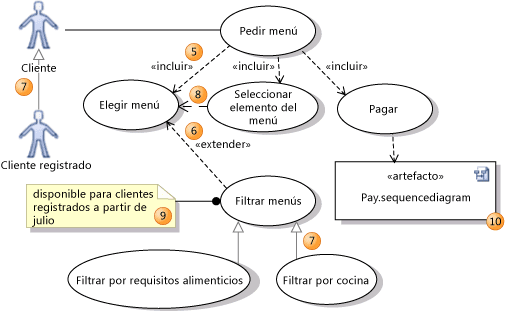

# Ejemplo 2 - Pruebas de caja negra

## :dart: Objetivo

- Analizar qué son las pruebas de tipo black box testing
- Comparar y distinguir las diferencias entre black box y white box testing
- Implementar pruebas de caja negra

## Desarrollo

### Análisis de valores límite

Es una prueba de caja negra ampliamente utilizada, que también es la base para la prueba de equivalencia. El análisis de
valor límite prueba el software con casos de prueba con valores extremos de datos de prueba. Boundary Value Analysis (
BVA) se utiliza para identificar las fallas o errores que surgen debido a los límites de los datos de entrada.

Por ejemplo: tomar entradas para los datos de un caso de prueba para una sección de edad debe aceptar datos válidos de
entre 1 y 100. Según el análisis de BVA, el software se probará con cuatro datos de prueba como -1, 1, 100 y 101 para
verificar la respuesta del sistema utilizando los valores límite.

### Partición de equivalencia

Esta técnica de diseño de casos de prueba verifica la entrada y la salida dividiendo la entrada en clases equivalentes.
Los datos deben probarse al menos una vez para garantizar la máxima cobertura de prueba de datos. Es la forma de prueba
exhaustiva, que también reduce la redundancia de entradas.

Por ejemplo: Tomar entradas para los datos de un caso de prueba para el ejemplo mencionado anteriormente tendrá tres
clases de las cuales se probará un dato.

Clase válida: 1 a 100 (cualquier número), Clase no válida: -1 (marcando la más baja de la más baja), Clase no válida:
101 (la más alta de la más alta).

### Transición entre estados

Esta técnica de prueba utiliza las entradas, salidas y el estado del sistema durante la fase de prueba. Compara el
software con la secuencia de transiciones o eventos entre los datos de prueba.

Según el tipo de software que se prueba, verifica los cambios de comportamiento de un sistema en un estado particular u
otro estado mientras mantiene las mismas entradas.

Por ejemplo, una página de inicio de sesión le permitirá ingresar el nombre de usuario y la contraseña hasta tres
intentos. Cada contraseña incorrecta se enviará al usuario a la página de inicio de sesión. Después del tercer intento,
el usuario será enviado a una página de error. Este método de transición de estado considera los diversos estados del
sistema y las entradas para pasar solo a la secuencia correcta de la prueba.

### Tablas de decisión

Este enfoque crea casos de prueba basados en varias posibilidades. Considera múltiples casos de prueba en un formato
de tabla de decisión donde cada condición se verifica y se cumple, para pasar la prueba y proporcionar resultados
precisos. Se prefiere en el caso de varias combinaciones de entrada y múltiples posibilidades.

Por ejemplo, una aplicación de entrega de alimentos verificará varios modos de pago como entrada para realizar el
pedido: toma de decisiones basada en la tabla.

Caso 1: si el usuario final tiene una tarjeta, el sistema no comprobará si hay efectivo o cupón y tomará medidas para
realizar el pedido.

Caso 2: Si el usuario final tiene un cupón, no se verificará si tiene una tarjeta o efectivo y se tomarán medidas.

Caso 3: si el usuario final tiene efectivo, se tomará la acción.

Caso 4: si el usuario final no tiene nada, no se tomarán medidas.

### Pruebas de casos de uso/ funcionales

Los casos de uso describen las interacciones entre actores (que pueden ser usuarios o sistemas) que producen un
resultado que agrega algún valor. A partir de estos se pueden derivar casos de prueba. Tienen precondiciones que deben
cumplirse para que estos funcionen de forma exitosa. Los casos de uso terminan con post-condiciones, que son resultados
observables y estado del sistema después de la ejecución. Son útiles para definir las pruebas de aceptación, en las que
participa el usuario o cliente.

