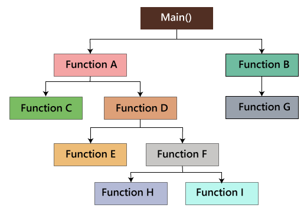
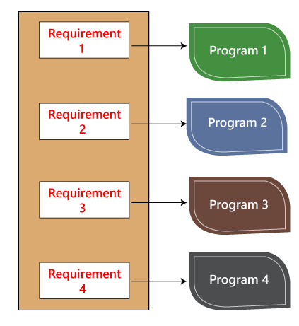
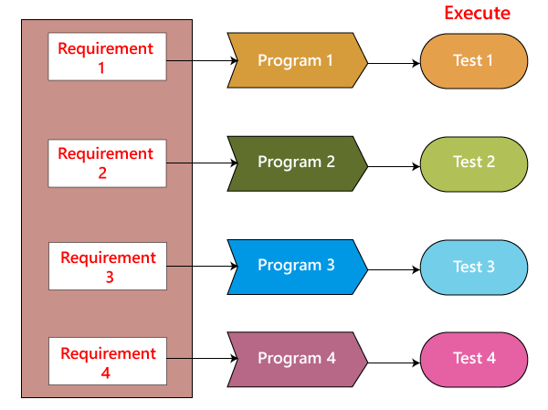

# Ejemplo 3 - Técnicas de caja blanca

## :dart: Objetivos

- Analizar qué son las pruebas de tipo white box testing
- Comparar y distinguir las diferencias entre black box y white box testing
- Implementar pruebas de caja blanca


## Desarrollo

### Prueba del camino básico (Path testing)

En la prueba de ruta, escribiremos los gráficos de flujo y probaremos todas las rutas independientes. Aquí, escribir el
gráfico de flujo implica que los gráficos de flujo representan el flujo del programa y también muestran cómo cada
programa se agrega entre sí, como podemos ver en la siguiente imagen:



Y probar todas las rutas independientes implica que suponga una ruta desde main () a la función G, primero configure los
parámetros y pruebe si el programa es correcto en esa ruta en particular, y de la misma manera pruebe todas las demás
rutas y corrija los errores.

### Prueba de ciclo o bucle

En la prueba de bucle, probaremos los bucles como while, for y do-while, etc. y también verificaremos la condición de
finalización si funciona correctamente y si el tamaño de las condiciones es suficiente.

Por ejemplo: tenemos un programa en el que los desarrolladores han dado alrededor de 50,000 bucles.

```{
    while (50000)
    ……
    ……
    }
```

No podemos probar este programa manualmente durante todo el ciclo de 50.000 bucles. Entonces escribimos un pequeño
programa que ayuda para los 50,000 ciclos, como podemos ver en el programa a continuación, que la prueba TestUno está
escrita en un lenguaje similar al programa de código fuente, y esto se conoce como prueba unitaria. Y está escrito solo
por los desarrolladores.

```
   TestUno {
    ……
    ……
    }    
```

Como podemos ver en la imagen de abajo, tenemos varios requisitos como 1, 2, 3, 4. Y luego, el desarrollador escribe los
programas como el programa 1,2,3,4 para las condiciones paralelas. Aquí la aplicación contiene las 100 líneas de código.



El desarrollador hará la prueba de caja blanca y probará los cinco programas línea por línea de código para encontrar el
error. Si encuentran algún error en alguno de los programas, lo corregirán. Y nuevamente tienen que probar el sistema,
entonces este proceso requiere mucho tiempo y esfuerzo y ralentiza el tiempo de lanzamiento del producto.

Ahora, supongamos que tenemos otro caso, donde los clientes quieren modificar los requisitos, luego el desarrollador
hará los cambios necesarios y probará los cuatro programas nuevamente, lo que requiere mucho tiempo y esfuerzo.

Estos problemas se pueden resolver de las siguientes formas:

En este caso, escribiremos una prueba para un programa similar donde el desarrollador escribe este código de prueba en
el lenguaje relacionado como código fuente. Luego ejecutan este código de prueba, que también se conoce como programas
de prueba unitaria. Estos programas de prueba están vinculados al programa principal y se implementan como pruebas.



Por lo tanto, si hay algún requisito de modificación o error en el código, el desarrollador realiza el ajuste tanto en
el programa principal como en el programa de prueba y luego ejecuta el programa de prueba.

### Pruebas de condiciones o condicionales

En este tipo de prueba necesitamos validar todas las condiciones para ambos valores: verdadero(true) y falso(false).
Probando todas las posibles combinaciones
```
if(condition) - true  
{  
…..  
……  
……  
}  
else - false  
{  
…..  
……  
……  
```