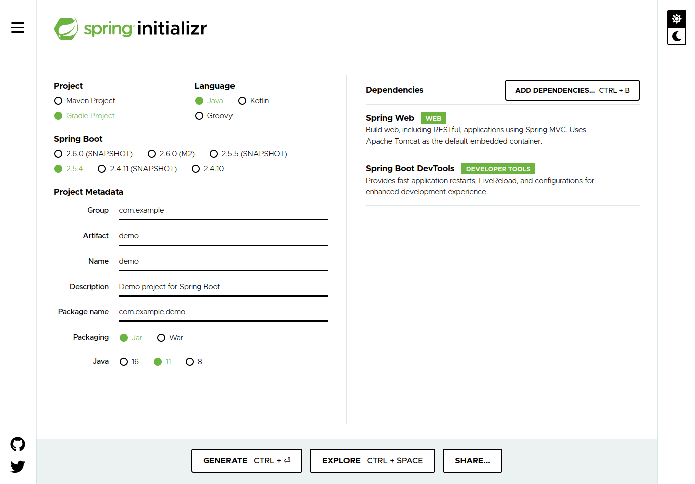
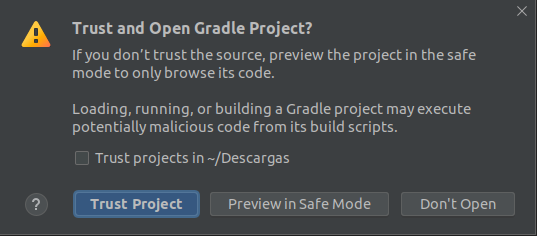

# Ejemplo 1 - Creación de un servicio básico y sus pruebas

## :dart: Objetivo

- Generar un servicio básico que utilizaremos como base para realizar pruebas con mocks

## ⚙ Requisitos

- IntelliJ IDEA
- Java
- Gradle
- JUnit
- Spring boot


## Desarrollo

A continuación iniciaremos un nuevo proyecto de spring boot, para ellos iremos a https://start.spring.io/ y nuestra
configuración debe quedar de la siguiente forma:



Posteriormente damos clic en _generate_ lo cual nos descarga el proyecto.

A continuación descomprimimos el archivo `demo.zip` y lo abrimos en nuestro IDE. En caso de que nos aparezca el
siguiente mensaje seleccionamos `Trust Project`



Ahora crearemos la siguiente clase: `demo/src/main/java/com/example/demo/business/SomeBusinessLogic.java`

```java
package com.example.demo.business;

public class SomeBusinessLogic {

    public int calculateSum(int[] data) {
        int sum = 0;
        for (int value : data) {
            sum += value;
        }
        return sum;
        //Functional Style
        //return Arrays.stream(data).reduce(Integer::sum).orElse(0);
    }
}

```

Como siguiente paso crearemos las pruebas necesarias para este servicio

`SomeBusinessLogicTest.java`
```java

package com.example.demo.business;

import org.junit.jupiter.api.Test;

import static org.junit.jupiter.api.Assertions.*;

class SomeBusinessLogicTest {

    @Test
    public void calculateSum_basic() {
        SomeBusinessLogic business = new SomeBusinessLogic();
        int actualResult = business.calculateSum(new int[]{1, 2, 3});
        int expectedResult = 6;
        assertEquals(expectedResult, actualResult);
    }


    @Test
    public void calculateSum_empty() {
        SomeBusinessLogic business = new SomeBusinessLogic();
        int actualResult = business.calculateSum(new int[] { });
        int expectedResult = 0;
        assertEquals(expectedResult, actualResult);
    }

    @Test
    public void calculateSum_oneValue() {
        SomeBusinessLogic business = new SomeBusinessLogic();
        int actualResult = business.calculateSum(new int[] { 5});
        int expectedResult = 5;
        assertEquals(expectedResult, actualResult);
    }
}

```