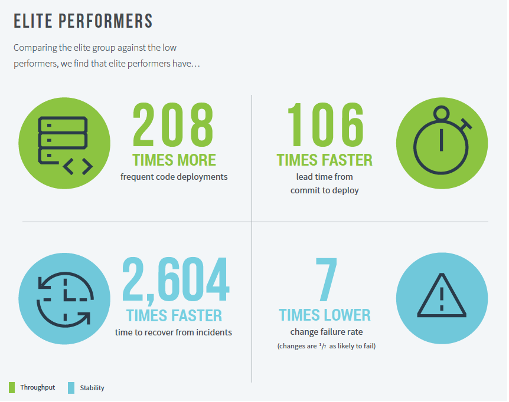
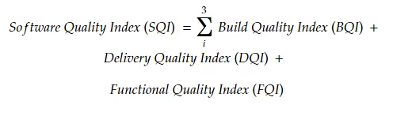

# Ejemplo 1 - Indice de calidad del software

## :dart: Objetivos

- Definir el concepto de calidad en software
- Diferenciar entre testing y calidad
- Utilizar herramienta y métricas que ayuden a definir la calidad

## Desarrollo

Como desarrolladores de software, la calidad del software es siempre una prioridad y muchas veces somos medidos por la
calidad que ofrecemos. Existen muchas herramientas para medir y controlar la calidad del software, pero antes de la
parte del cómo, el primer paso es averiguar qué medir para la calidad.

Anku Kumar define el _Software Quality Index (SQI)_, con tres dimensiones de calidad como parte de la entrega de
productos / software:

     Calidad de construcción: calidad del código que cumple con los requisitos funcionales y no funcionales
     Calidad de entrega: el código de entrega no siempre ayuda; El equipo empresarial / ejecutivo le gusta medir el éxito en términos de costo, tiempo y calidad.
     Calidad funcional: para garantizar que el código propagado a producción cumpla con todos los matices de las pruebas

Para cada una de las dimensiones, tener un "Índice de calidad" definido basado en métricas aplicables para su
organización o producto ayuda a construir y entregar un producto de mejor calidad.

Una vez que se han definido las métricas, automatizar la captura / medición de estas métricas, monitorear regularmente y
actuar con base en la información para mejorar iterativamente ayuda a mejorar progresivamente.

Con base en lo anterior, el Índice de calidad del software debe definirse, medirse y establecerse como referencia para
cada producto:

