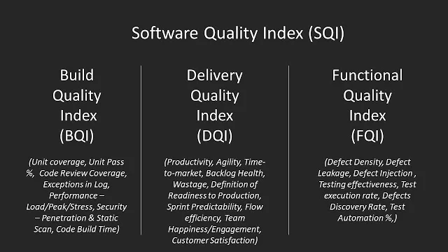

# Ejemplo 1 - Métricas DORA

## :dart: Objetivos

- Definir el concepto de calidad en software
- Diferenciar entre testing y calidad
- Utilizar herramienta y métricas que ayuden a definir la calidad

## Desarrollo

El proceso de desarrollo de software no es fácil de medir y administrar, particularmente a medida que se vuelve más
complejo y descentralizado. En muchas empresas, hay varios equipos que trabajan en partes más pequeñas de un gran
proyecto, y estos equipos están repartidos por todo el mundo. Es un desafío saber quién está haciendo qué y cuándo, si
existen cosas que esten bloqueando al equipo y qué tipo ha sido lo que retrasado el proceso. Sin un conjunto confiable
de puntos de datos para rastrear a través de los equipos, es virtualmente imposible ver cómo encaja cada pieza del
rompecabezas del proceso de desarrollo de aplicaciones. Las métricas de DORA pueden ayudar a arrojar luz sobre el
desempeño de sus equipos en DevOps.

¿Qué son las métricas DORA?

Estas métricas no surgieron de la nada. Las métricas de DORA son el resultado de seis años de encuestas realizadas por
el equipo de DORA (DevOps Research and Assessments) que, entre otros puntos de datos, miden específicamente la
frecuencia de implementación (DF), el tiempo medio de espera para cambios (MLT), el tiempo medio para recuperarse
después de un fallo (MTTR) y tasa de fallo en cambios (CFR). Estas métricas sirven como una guía de qué tan bien se
están desempeñando los equipos de ingeniería y qué tan exitosa es una empresa en DevOps, que van desde los "de bajo
rendimiento" hasta los "de élite". Ayudan a responder la pregunta: ¿Somos mejores en DevOps ahora que hace un año?

Los resultados y datos de la investigación de DORA se han convertido en un estándar de medición para aquellas personas
que son responsables de rastrear el desempeño de DevOps en su organización. Los líderes de ingeniería y DevOps deben
comprender estas métricas para administrar el rendimiento de DevOps y mejorar con el tiempo.

¿Por qué es tan importante realizar un seguimiento de las métricas de DORA?

Sencillo. Ayudan a DevOps y a los líderes de ingeniería a medir el rendimiento (velocidad) y la estabilidad (calidad) de
la entrega de software. Muestran cómo los equipos de desarrollo pueden ofrecer un mejor software a sus clientes, más
rápido. Estas métricas brindan a los líderes datos concretos para que puedan medir el desempeño de DevOps de la
organización, y para que puedan informar a los ejecutivos y recomendar mejoras.

Las métricas de DORA ayudan a alinear los objetivos de desarrollo con los objetivos comerciales. Desde la perspectiva de
la gestión de productos, ofrecen una visión de cómo y cuándo los equipos de desarrollo pueden satisfacer las necesidades
de los clientes. Para los líderes de ingeniería y DevOps, estas métricas pueden ayudar a demostrar que la implementación
de DevOps tiene un valor comercial claro.

