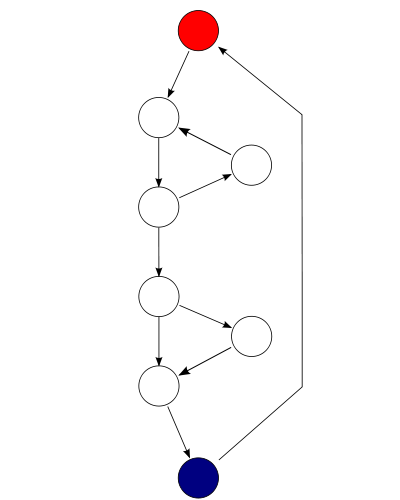
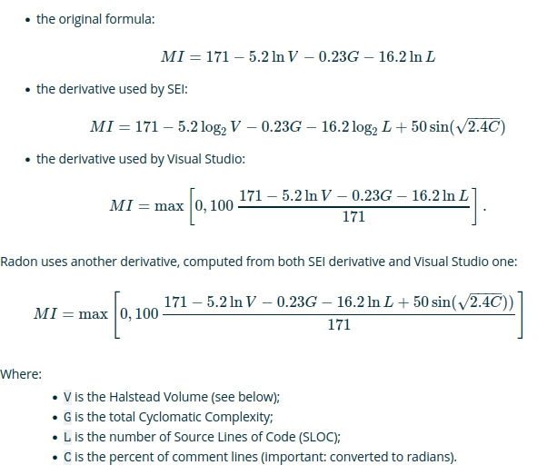

# Ejemplo 2 - Otras métricas

## :dart: Objetivos

- Definir el concepto de calidad en software
- Diferenciar entre testing y calidad
- Utilizar herramienta y métricas que ayuden a definir la calidad

## Desarrollo

### Complejidad Ciclomática

La Complejidad Ciclomática corresponde al número de decisiones que contiene un bloque de código más 1. Este número (
también llamado número de McCabe) es igual al número de caminos linealmente independientes a través del código. Este
número se puede utilizar como guía al probar la lógica condicional en bloques.

Las herramientas suelen hacer un análisis al árbol AST (Abstract Syntax Tree) de un programa para calcular la
Complejidad Ciclomática.

#### Ejemplos:

El programa comienza a ejecutarse en el nodo rojo, luego entra en un bucle (grupo de tres nodos inmediatamente debajo
del nodo rojo). Al salir del ciclo, hay una declaración condicional (grupo debajo del ciclo), y finalmente el programa
sale en el nodo azul. Este gráfico tiene 9 aristas, 8 nodos y 1 componente conectado, por lo que la complejidad
ciclomática del programa es 9 - 8 + 2 * 1 = 3.

La misma función que la anterior, representada mediante la formulación alternativa, donde cada punto de salida se
conecta de nuevo al punto de entrada. Este gráfico tiene 10 bordes, 8 nodos y 1 componente conectado, lo que también da
como resultado una complejidad ciclomática de 3 utilizando la formulación alternativa (10 - 8 + 1 = 3).

### Indice de mantenibilidad

El índice de mantenibilidad es una métrica de software que mide qué tan mantenible (fácil de mantener y cambiar) es el
código fuente. El índice de mantenibilidad se calcula como una fórmula factorizada que consta de SLOC (líneas de código
fuente), complejidad ciclomática y volumen de Halstead. Se utiliza en varias herramientas métricas de software
automatizadas, incluido el entorno de desarrollo Microsoft Visual Studio 2010, que utiliza una derivada de escala
desplazada (0 a 100).

#### Formulas comunes:

