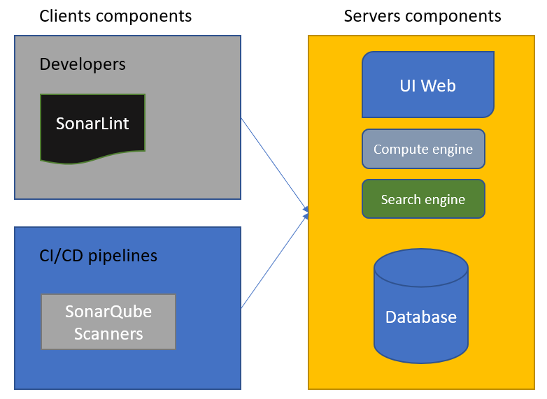

# Ejemplo 1 - Introducción a SonarQube

## :dart: Objetivos

- Identificar criterios de calidad en el software
- Analizar los criterios de análisis estático del código
- Ejecutar un análisis estático con SonarQube

## Desarrollo

SonarQube es una herramienta de código abierto de SonarSource (https://www.sonarsource.com/) que está escrita en Java.
Nos permite realizar análisis de código estático para verificar la calidad y seguridad del código de una aplicación.

SonarQube está diseñado para equipos de desarrolladores y les proporciona un panel e informes que se pueden personalizar
para que puedan presentar la calidad del código en sus aplicaciones.

Permite el análisis de código estático en una multitud de lenguajes (más de 25), como PHP, Java, .NET, JavaScript,
Python, etc. La lista completa se puede encontrar en https://www.sonarqube.org/features/multi-languages/. Además del
análisis de código con problemas de seguridad, code smells y duplicación de código, SonarQube también proporciona
cobertura de código para pruebas unitarias.

Finalmente, SonarQube se integra muy bien en los pipelines de CI / CD para que pueda automatizar el análisis de código
durante los commits de código del desarrollador. Esto reduce el riesgo de implementar una aplicación que tiene
vulnerabilidades de seguridad o una complejidad de código demasiado alta.

Ahora que hemos proporcionado una descripción general de SonarQube, veremos su arquitectura y componentes. Finalmente,
veremos las diferentes formas de instalarlo.

## Descripción general de la arquitectura SonarQube

SonarQube es una herramienta cliente-servidor, lo que significa que su arquitectura se compone de artefactos en el lado
del servidor y también en el lado del cliente.

En el siguiente diagrama se muestra una arquitectura SonarQube simplificada:

Veamos los componentes que se muestran en el diagrama anterior. Los componentes que componen SonarQube en el lado del
servidor son los siguientes:

    Una base de datos SQL Server, MySQL, Oracle o PostgreSQL que contiene todos los datos de análisis.
    Una aplicación web que muestra los paneles.
    El motor de cálculo, que se encarga de recuperar el análisis y los procesos. Y los pone en la base de datos.
    Un motor de búsqueda creado con Elasticsearch.

Los componentes del lado del cliente son los siguientes:

    El escáner, que escanea el código fuente de las aplicaciones y envía los datos al motor de cálculo.
    El escáner generalmente se instala en los agentes de compilación que se utilizan para ejecutar pipelines de CI / CD.
    SonarLint es una herramienta que se instala en las estaciones de trabajo de los desarrolladores para realizar análisis en tiempo real. 

Para obtener más detalles sobre esta arquitectura, podemos consultar la arquitectura de SonarQube y la documentación de
integración, que se puede encontrar en https://docs.sonarqube.org/latest/architecture/architecture-integration/.

Ahora que hemos visto su arquitectura y componentes, aprenderemos cómo instalarlo.