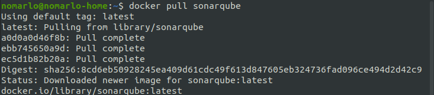
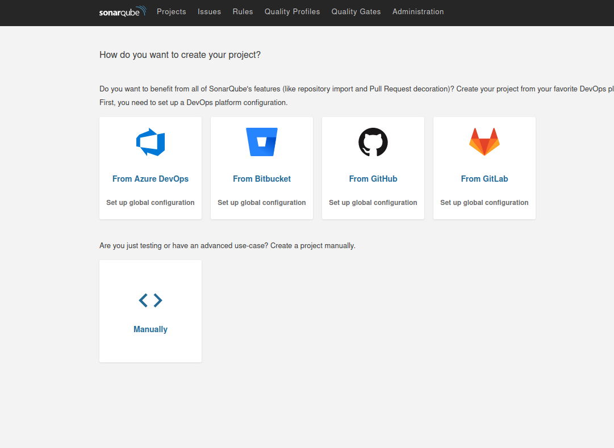
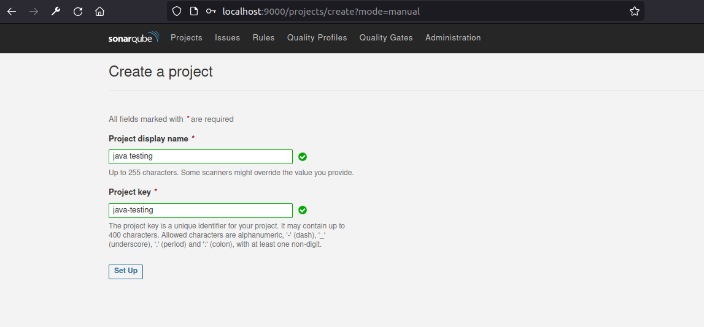
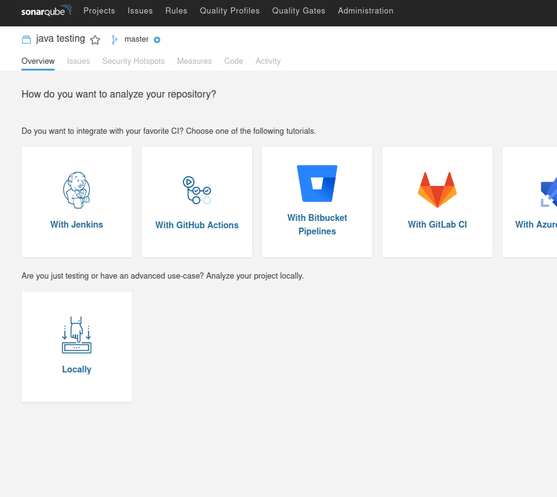
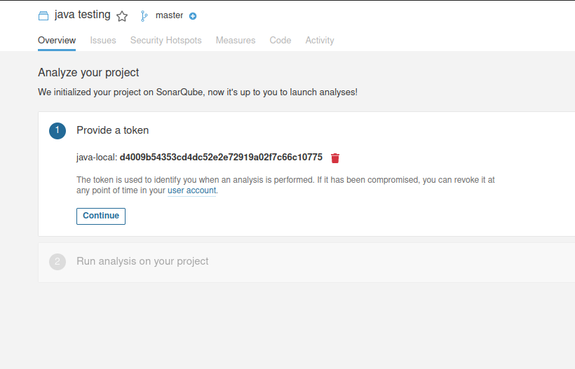
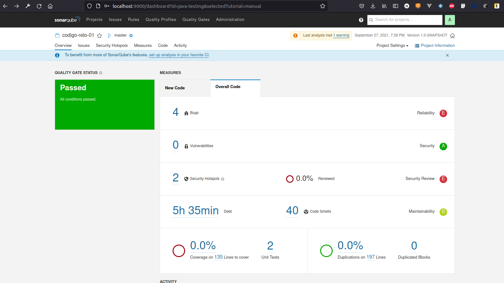

# Ejemplo 2 - Instalación de SonarQube

## :dart: Objetivos

- Identificar criterios de calidad en el software
- Analizar los criterios de análisis estático del código
- Ejecutar un análisis estático con SonarQube


## ⚙ Requisitos

- IntelliJ IDEA
- Java
- Gradle
- SonarQube
- Docker

## Desarrollo

### Instalación de SonarQube

SonarQube es una solución local. En otras palabras, debe instalarse en servidores o máquinas virtuales. Además,
SonarQube consta de varios componentes que analizarán el código fuente de las aplicaciones, recuperarán y almacenarán
los datos de este análisis y proporcionarán informes sobre la calidad y seguridad del código.

SonarQube se puede instalar de diferentes formas: ya sea manualmente o instalando un contenedor Docker desde la imagen
de Sonar. Alternativamente, si tenemos Azure, podemos usar una máquina virtual SonarQube del Marketplace. Echemos un
vistazo más de cerca a cada una de estas opciones.

#### Instalación a través de Docker

Si queremos instalar SonarQube Community con fines de prueba o demostración, podemos instalarlo a través de la imagen
oficial de Docker que está disponible en Docker Hub en https://hub.docker.com/_/sonarqube/.

Esta imagen utiliza una pequeña base de datos integrada que no está hecha para producción.

Copiar y pegar el siguiente comando:

`docker pull sonarqube`



Inicializar el server con:

`docker run -d --name sonarqube -e SONAR_ES_BOOTSTRAP_CHECKS_DISABLE=true -p 9000:9000 sonarqube:latest`

Inicia sesión en [http://localhost:9000](http://localhost:9000)

    login: admin
    password: admin

### Analizar un proyecto

Ahora que has iniciado sesión en tu instancia local de SonarQube, analicemos un proyecto:



     Da clic en el botón Crear nuevo proyecto manual.
     Asigna a tu proyecto una clave de proyecto y un nombre para mostrar y haga clic en el botón Configurar.



    A continuación damos clic en Localmente



     En Proporcionar un token, selecciona Generar un token. Asigna un nombre a tu token, da clic en el botón Generar y despúes en Continuar.




     Selecciona Gradle en Ejecutar análisis en su proyecto y sigue las instrucciones para analizar tu proyecto. Aquí se descargará y ejecutará un escáner en tu código (con Maven o Gradle, el escáner se descarga automáticamente).

Ahora modificaremos nuestro archivo `build.gradle`

```
plugins {
    id 'java'
    id "org.sonarqube" version "3.3"
}

group 'org.example'
version '1.0-SNAPSHOT'

repositories {
    mavenCentral()
}

dependencies {
    testImplementation 'org.junit.jupiter:junit-jupiter-api:5.8.0'
    testRuntimeOnly 'org.junit.jupiter:junit-jupiter-engine:5.8.0'
}

test {
    useJUnitPlatform()
}
```

Y ejecutamos:

`./gradlew sonarqube -Dsonar.projectKey=java-testing -Dsonar.host.url=http://localhost:9000   -Dsonar.login=d4009b54353cd4dc52e2e72919a02f7c66c10775`

Si todo se ejecuta de forma correcta debería abrir en nuestro navegador la siguiente información:


