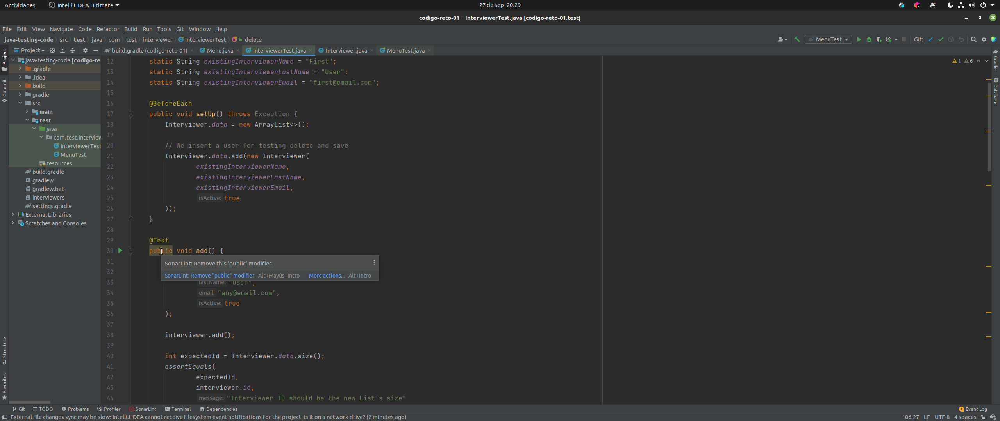

# Ejemplo 3 - SonaLint

## :dart: Objetivos

- Identificar criterios de calidad en el software
- Analizar los criterios de análisis estático del código
- Ejecutar un análisis estático con SonarQube

## ⚙ Requisitos

- IntelliJ IDEA
- Java
- Gradle
- SonarQube
- Docker
- SonarLint

## Desarrollo

### Instalación de SonarLint

En IntelliJ desde `Settings/Plugins` buscamos `SonarLint` y procedemos a instalarlo.

Después de reiniciar nuestro IDE veremos como SonaLint nos indica los "problemas" en nuestro código.

