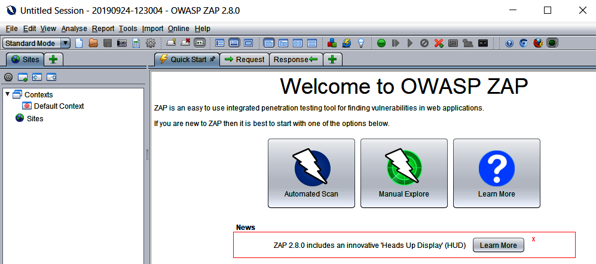
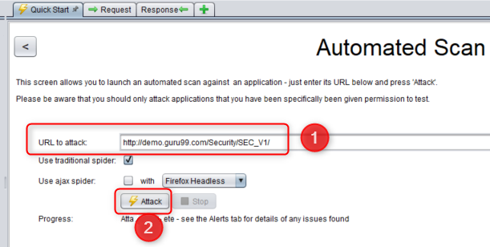
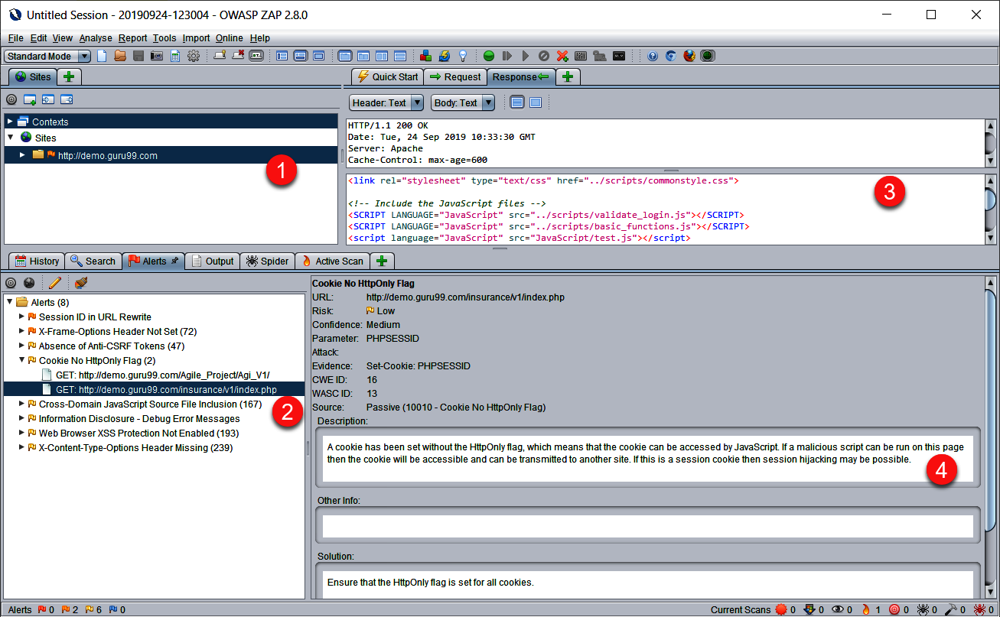

# Ejemplo 4 - Security test con ZAP

## :dart: Objetivos

- Analizar los 10 riesgos de seguridad más frecuentes en aplicaciones web (OWASP Top Ten)

## ⚙ Requisitos

- IntelliJ IDEA
- Java
- Gradle
- ZAP

## Desarrollo

### Uso de ZAP para pruebas de seguridad

ZAP es una herramienta gráfica, gratuita y de código abierto que permite escanear sitios web y realizar una multitud de
pruebas de seguridad y penetración.

A diferencia de SonarQube, que también realiza análisis de seguridad, ZAP ejecuta la aplicación y realiza pruebas de
seguridad. Si bien SonarQube realiza un análisis de seguridad en el código fuente de la aplicación, no lo ejecuta.

Cuando se ejecuta, ZAP actuará como un proxy entre el usuario y la aplicación al escanear todas las URL de la aplicación
y luego realizar una serie de pruebas de penetración en estas diferentes URL. Actualmente es una de las herramientas más
utilizadas en las pruebas de aplicaciones porque, además de ser gratuita, proporciona muchas características muy
interesantes, como la capacidad de configurar pruebas de penetración Ajax, y también configuraciones de prueba
avanzadas. Además, se integra muy bien con muchas plataformas de pipeline CI / CD, y finalmente, es posible controlarlo
usando API REST, cuya documentación se encuentra en https://github.com/zaproxy/zaproxy/wiki/ApiDetails.

Un requisito previo para usar ZAP es tener Java instalado en la máquina que realizará las pruebas. Puede ser una máquina
local o un agente de compilación.

Podemos descargar ZAP en https://github.com/zaproxy/zaproxy/wiki/Downloads; descarga el paquete correspondiente a tu
sistema operativo.

Luego, instala ZAP siguiendo los procedimientos de instalación del software de tu SO y, una vez finalizada la
instalación, podemos abrir ZAP y acceder a su interfaz.

Esta captura de pantalla muestra la interfaz ZAP predeterminada:

Haremos nuestro primer análisis de seguridad con ZAP siguiendo estos pasos:

    En el panel de la derecha, da clic en el botón Escaneo Automático, que abre un formulario en el que ingresamos la URL a escanear.
    En el campo URL para atacar, ingresa la URL del sitio web a analizar. En nuestro ejemplo, ingresamos la URL de un sitio de demostración: http://demo.guru99.com/Security/SEC_V1/
    Luego, para iniciar el análisis, hacemos clic en el botón Atacar.

La siguiente captura de pantalla muestra los pasos anteriores visualmente:

Esperamos que se complete el análisis de la prueba de seguridad de este sitio web.

    Tan pronto como se completa el análisis, podemos ver el resultado de los problemas de seguridad encontrados en el panel de la parte inferior izquierda.
    Por último, hacer clic en una de las alertas muestra los detalles del problema y nos ayuda a solucionarlo.

La siguiente pantalla muestra la visualización de los resultados del análisis que acabamos de detallar:

Acabamos de ver cómo utilizar ZAP, que es una herramienta gráfica que se utiliza para analizar las vulnerabilidades de
seguridad de un sitio web muy rápidamente.
